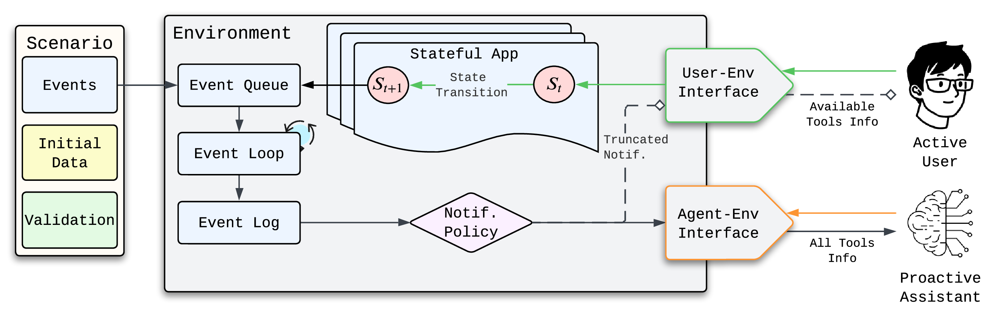
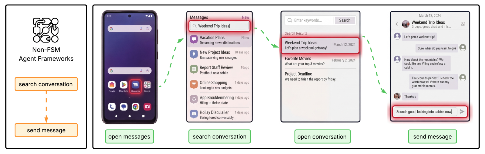

# PARE: Proactive Agent Research Environment

[](https://arxiv.org/abs/2604.00842)
[](https://codecov.io/gh/deepakn97/pare)
[](https://img.shields.io/github/commit-activity/m/deepakn97/pare)
[](https://img.shields.io/github/license/deepakn97/pare)

**PARE** is a Python research framework for evaluating proactive AI assistants through active user simulation. Built on top of [Meta-ARE](https://github.com/deepakn97/meta-are), it provides a realistic mobile-phone simulation environment where a proactive assistant must observe user behavior, infer goals, and intervene helpfully -- without being asked.

- **Paper**: [PARE: Simulating Active Users to Evaluate Proactive Assistants](https://arxiv.org/abs/2604.00842)
- **Documentation**: [deepakn97.github.io/pare](https://deepakn97.github.io/pare/)

## What is PARE?

Proactive assistants need to decide *when* to help and *what* to do -- all from passively observing user activity. Evaluating this requires simulating realistic users in realistic environments, which is what PARE provides:

- **9 domain apps** modeled as finite state machines: Apartment, Cab, Calendar, Contacts, Email, Messaging, Note, Reminder, and Shopping
- **2 core system apps**: `HomeScreenSystemApp` for navigation (open, switch, go home) and `PAREAgentUserInterface` for proposal management (accept/reject)
- **143 benchmark scenarios** spanning multi-app orchestration, goal inference, and intervention timing
- **Observe-Execute agent architecture** with configurable models per stage
- **Oracle validation** to automatically verify task completion

<p align="center">
  
</p>

## How It Works

PARE orchestrates a **two-agent simulation**: a *user agent* that navigates the phone realistically, and a *proactive agent* that observes and intervenes.

The key insight is **asymmetric interfaces**. The user agent sees only the tools available on the current screen (just like a real user tapping through apps), while the proactive agent gets flat API access to all apps for efficient task execution. This forces realistic user behavior without handicapping the assistant.

<p align="center">
  
</p>
<p align="center"><em>Sending a message requires navigating through screens for the user (right), but a single API call for the assistant (left).</em></p>

## Quick Start

### Prerequisites

- Python 3.12+
- [uv](https://github.com/astral-sh/uv) package manager

### Installation

```bash
git clone git@github.com:deepakn97/pare.git
cd pare
make install
```

### Configure API Keys

Copy the example environment file and fill in your API keys:

```bash
cp .env.example .env
```

Edit `.env` with the keys for the providers you plan to use:

```bash
# Required for GPT models (gpt-5, gpt-5-mini, gpt-4o, etc.)
OPENAI_API_KEY=your_openai_api_key_here

# Required for Hugging Face model access
HF_TOKEN=your_hf_token_here

# Required for AWS Bedrock models (llama-4-scout, llama-4-maverick, etc.)
AWS_ACCESS_KEY_ID=aws_access_key_id
AWS_SECRET_ACCESS_KEY=secret_access_key_id
AWS_REGION_NAME="us-east-1"
# Or use the new Bedrock API key:
AWS_BEARER_TOKEN_BEDROCK=new_aws_api_key_here

# Scenario configuration (defaults to benchmark/)
PARE_SCENARIOS_DIR=benchmark

# Path to environment augmentation data (relative to project root)
ENV_AUGMENTATION_DATA_PATH="data/metaare_augmentation_data.json"
```

### Run a Single Scenario

Models registered in `MODELS_MAP` (see `pare/cli/utils.py`) can be used by alias without specifying `--provider`:

```bash
pare benchmark run -s email_notification -om gpt-5 -em gpt-5
```

### Run the Full Benchmark

```bash
pare benchmark run --split full -om gpt-5 -em gpt-5 --runs 3
```

### Using a YAML Config File

```bash
pare benchmark run --config experiments/my_experiment.yaml
```

Example config file:

```yaml
observe_model: "gpt-5"
execute_model: "gpt-5"
user_model: "gpt-5-mini"
split: "full"
runs: 3
```

### Locally Hosted Models

For models not in `MODELS_MAP`, specify `--provider` (and `--endpoint` for locally served models):

```bash
pare benchmark run --split full \
  --observe-model liquid/lfm2.5-350m \
  --observe-provider hosted_vllm \
  --observe-endpoint http://localhost:8001/v1 \
  --execute-model google/gemma-4-26b-a4b-it \
  --execute-provider hosted_vllm \
  --execute-endpoint http://localhost:8002/v1
```

### Results

Results are saved in a structured directory under `results/`:

```
results/
  {experiment}_{split}_user_{model}_mt_{turns}_umi_..._omi_..._emi_.../
    obs_{model}_exec_{model}_..._result.json
    obs_{model}_exec_{model}_..._report.txt
```

Use `pare benchmark run --help` for the full list of configuration options.

### Other CLI Commands

```bash
pare annotation sample -t <traces_dir> -n <size>   # Sample decision points for human eval
pare annotation launch                               # Launch annotation UI
pare cache status                                    # Show cache location and entry count
pare cache invalidate                                # Clear cached results
```

> [!NOTE]
> **macOS users**: The `--executor-type process` option may fail due to a known Python multiprocessing issue with the 'spawn' method on macOS. Use the default `--executor-type thread` instead.

## Documentation

Full API reference and architecture docs are available at [deepakn97.github.io/pare](https://deepakn97.github.io/pare/).

## Contributing

See [CONTRIBUTING.md](CONTRIBUTING.md) for development setup, code style guidelines, and how to submit pull requests.

## License

This project is licensed under the terms of the [MIT License](LICENSE).

## Citation

If you use PARE in your research, please cite:

```bibtex
@misc{nathani2026proactiveagentresearchenvironment,
      title={Proactive Agent Research Environment: Simulating Active Users to Evaluate Proactive Assistants},
      author={Deepak Nathani and Cheng Zhang and Chang Huan and Jiaming Shan and Yinfei Yang and Alkesh Patel and Zhe Gan and William Yang Wang and Michael Saxon and Xin Eric Wang},
      year={2026},
      eprint={2604.00842},
      archivePrefix={arXiv},
      primaryClass={cs.AI},
      url={https://arxiv.org/abs/2604.00842},
}
```
