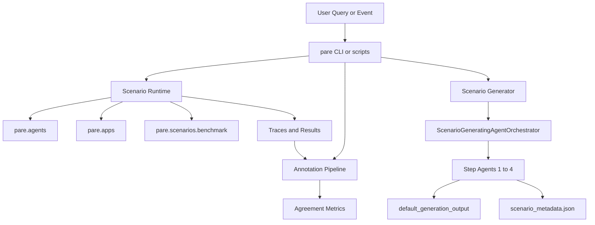
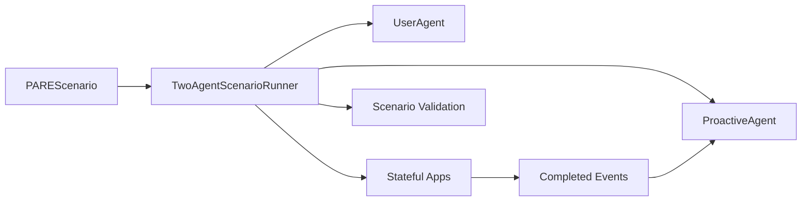
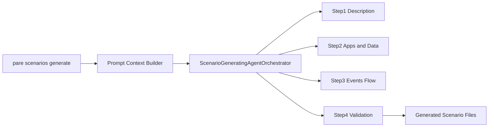
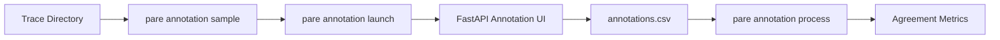

# PARE Architecture - Visual Overview

## System Map

```mermaid
flowchart TD
    user[User Query or Event] --> cli[pare CLI or scripts]
    cli --> run[Scenario Runtime]
    cli --> gen[Scenario Generator]
    cli --> ann[Annotation Pipeline]

    run --> agents[pare.agents]
    run --> apps[pare.apps]
    run --> scenarios[pare.scenarios.benchmark]
    run --> traces[Traces and Results]

    gen --> orch[ScenarioGeneratingAgentOrchestrator]
    orch --> step2[Step Agents 1 to 4]
    step2 --> generated[default_generation_output]
    step2 --> metadata[scenario_metadata.json]

    traces --> ann
    ann --> metrics[Agreement Metrics]
```

## Runtime Execution Path

```mermaid
flowchart LR
    scenario[PAREScenario] --> runner[TwoAgentScenarioRunner]
    runner --> userAgent[UserAgent]
    runner --> proactiveAgent[ProactiveAgent]
    runner --> appLayer[Stateful Apps]
    appLayer --> events[Completed Events]
    events --> proactiveAgent
    runner --> validation[Scenario Validation]
```

## Generator Path

```mermaid
flowchart LR
    cliGen[pare scenarios generate] --> context[Prompt Context Builder]
    context --> orchestrator[ScenarioGeneratingAgentOrchestrator]
    orchestrator --> step1[Step1 Description]
    orchestrator --> step2[Step2 Apps and Data]
    orchestrator --> step3[Step3 Events Flow]
    orchestrator --> step4[Step4 Validation]
    step4 --> output[Generated Scenario Files]
```

## Annotation Path

```mermaid
flowchart LR
    traces[Trace Directory] --> sample[pare annotation sample]
    sample --> launch[pare annotation launch]
    launch --> ui[FastAPI Annotation UI]
    ui --> csv[annotations.csv]
    csv --> process[pare annotation process]
    process --> report[Agreement Metrics]
```
